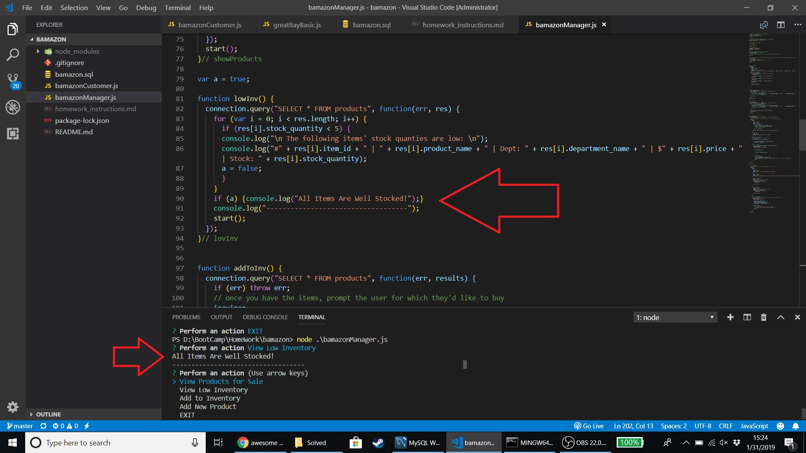

# bamazon
For some reason the low inventory doesn't print the line on gitbash where I'm capturing the window, but it does appear on the terminal in VSC.  I have attached a screenshot of the line printing and the code calling for the line to print.

Link to customer video can be found here:https://youtu.be/95ppmD2gCaI
Link to manager video can be found here:https://youtu.be/sGY3v_fUbsU
Screenshot showing well shocked function working 